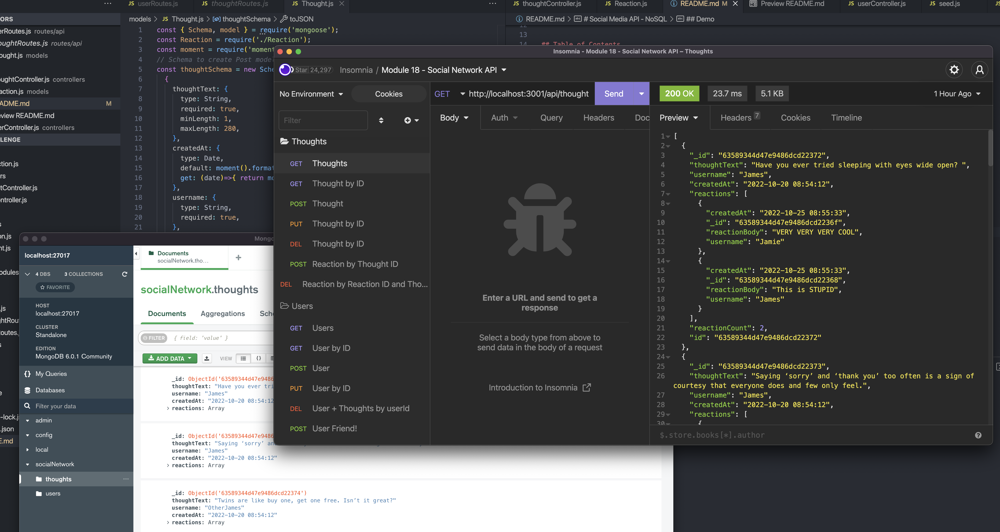

 
 

# Social Media API - NoSQL

## Description

Social Network API powered by MongoDB... a NoSQL driven api service application that can power a social network of friends and shared thoughts and reactions.  Users can have friends and thoughts with reactions by friends or user.  API provides CRUD operations for Users and Thoughts, and CRD operations for Reactions.  Deleting a user will remove that user from others' friend array as well as their thoughts.  Deleting a thought will remove that thought from the User's thoughts array.

## Table of Contents

- [Demo and Screen Shots](#demo)
- [Installation](#installation)
- [Usage](#usage)
- [Credits](#credits)
- [License](#license)
- [Questions](#questions)

## Demo
***

Demo:
[Demo Video Link](https://drive.google.com/file/d/1KjW-DwfQJvO-JKvwX2NGsv-5Xb_IofUd/view)

Screen Shot:

## Installation
***

1. clone repository.  
2. 'npm i' to install packages.  
3. (optional) - Seed data and seeding is provided in 'utils' directory. 'npm run seed' to seed database. 

## Usage
***

'node index.js' to run api services.  Run routes to http://localhost:3001/api/[users/thoughts].

## Credits
 ***

[ConradJohnson](https://github.com/ConradJohnson)

 ## License
 ***

  ISC License

  [https://opensource.org/licenses/ISC](https://opensource.org/licenses/ISC)
  
  Permission to use, copy, modify, and/or distribute this software for any
  purpose with or without fee is hereby granted, provided that the above
  copyright notice and this permission notice appear in all copies.
  
  THE SOFTWARE IS PROVIDED "AS IS" AND THE AUTHOR DISCLAIMS ALL WARRANTIES WITH
  REGARD TO THIS SOFTWARE INCLUDING ALL IMPLIED WARRANTIES OF MERCHANTABILITY
  AND FITNESS. IN NO EVENT SHALL THE AUTHOR BE LIABLE FOR ANY SPECIAL, DIRECT,
  INDIRECT, OR CONSEQUENTIAL DAMAGES OR ANY DAMAGES WHATSOEVER RESULTING FROM
  LOSS OF USE, DATA OR PROFITS, WHETHER IN AN ACTION OF CONTRACT, NEGLIGENCE OR
  OTHER TORTIOUS ACTION, ARISING OUT OF OR IN CONNECTION WITH THE USE OR
  PERFORMANCE OF THIS SOFTWARE.
  
  Copyright (c) 2022 James Johnson
          

# Questions
***
For questions or assistance, please contact through [GitHub Account](https://github.com/ConradJohnson) or email: [notmyemail@gmail.com](mailto:notmyemail@gmail.com)

 [Back to top](#description)